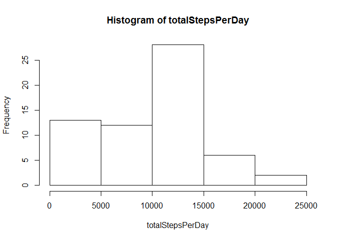
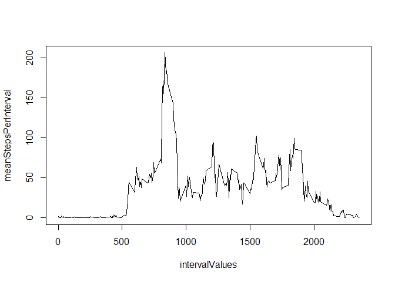
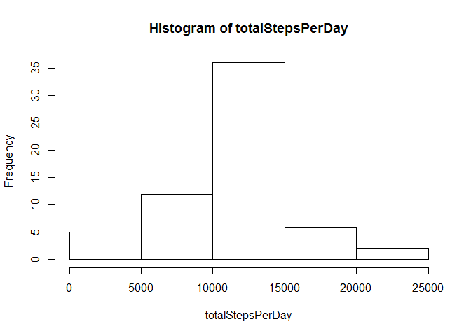
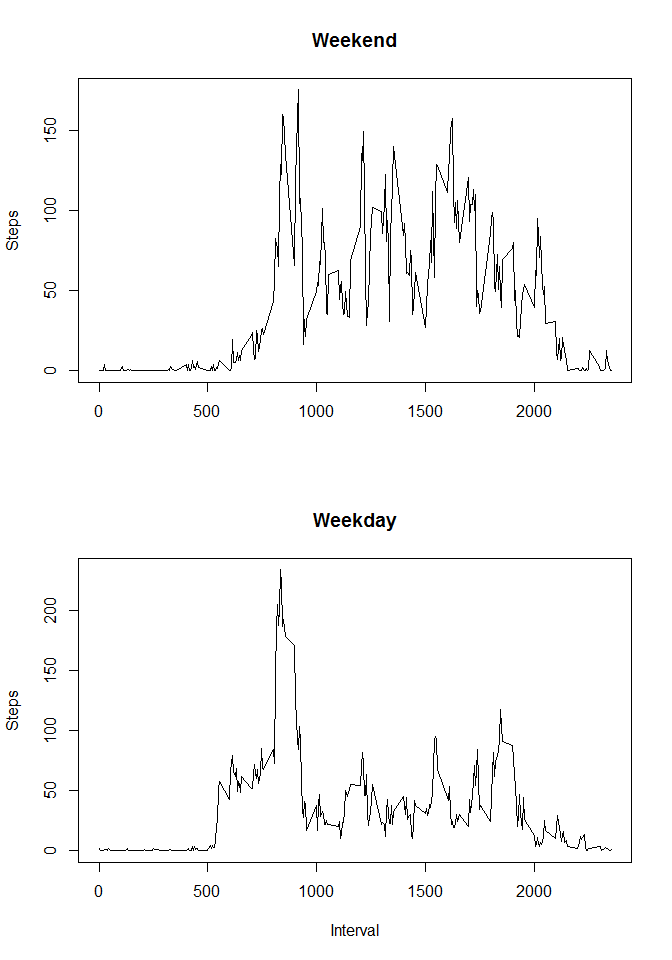

# Reproducible Research: Peer Assessment 1


## Loading and preprocessing the data

Unizp and load the data. Present a summary of the data


```r
unzip("activity.zip",overwrite=TRUE)
data<-read.csv("activity.csv")

summary(data)
```

```
##      steps                date          interval     
##  Min.   :  0.00   2012-10-01:  288   Min.   :   0.0  
##  1st Qu.:  0.00   2012-10-02:  288   1st Qu.: 588.8  
##  Median :  0.00   2012-10-03:  288   Median :1177.5  
##  Mean   : 37.38   2012-10-04:  288   Mean   :1177.5  
##  3rd Qu.: 12.00   2012-10-05:  288   3rd Qu.:1766.2  
##  Max.   :806.00   2012-10-06:  288   Max.   :2355.0  
##  NA's   :2304     (Other)   :15840
```


## What is mean total number of steps taken per day?
Sum all the steps per day and show the histogram as well as the median and mean


```r
totalStepsPerDay<-tapply(data$steps,data$date,sum,na.rm=TRUE)
hist(totalStepsPerDay)
```

 

```r
median(totalStepsPerDay)
```

```
## [1] 10395
```

```r
mean(totalStepsPerDay)
```

```
## [1] 9354.23
```


## What is the average daily activity pattern?
Take the mean of the number of the steps per interval and plot them

Then show the interval that presents the maximum average steps


```r
intervalValues<-levels(as.factor(data$interval))
meanStepsPerInterval<-tapply(data$steps,data$interval,mean,na.rm=TRUE)
plot(intervalValues,meanStepsPerInterval,type='l')
```

 

```r
intervalValues[which.max(meanStepsPerInterval)]
```

```
## [1] "835"
```


## Imputing missing values
First count how many NA's are in the steps data

Then fill them with the mean step per interval.  On the filled data calculate the sum of the steps per day, then show the histogram, median and mean

```r
sum(is.na(data$steps))
```

```
## [1] 2304
```

```r
dataFull<-data

dataFull$steps[is.na(dataFull$steps)]<-meanStepsPerInterval[as.factor(data$interval)][is.na(dataFull$steps)]

totalStepsPerDay<-tapply(dataFull$steps,dataFull$date,sum,na.rm=FALSE)
hist(totalStepsPerDay)
```

 

```r
median(totalStepsPerDay)
```

```
## [1] 10766.19
```

```r
mean(totalStepsPerDay)
```

```
## [1] 10766.19
```


## Are there differences in activity patterns between weekdays and weekends?
Create a factor to determine if the day is a Weekend or a Weekday.  Based on that compute the average number of steps per interval per type of day.

Plot on the same plot


```r
data$date<-as.Date(data$date)
data$TypeOfDay<-"Weekday"
data$TypeOfDay[weekdays(data$date) %in% c("Saturday","Sunday")]<-"Weekend"
data$TypeOfDay<-as.factor(data$TypeOfDay)

averageStepsByIntervalByDayType<-tapply(data$steps,list(data$interval,data$TypeOfDay),mean,na.rm=TRUE)

par(mfrow=c(2,1))
plot(intervalValues,averageStepsByIntervalByDayType[,2], main="Weekend",type="l",xlab="",ylab="Steps")
plot(intervalValues,averageStepsByIntervalByDayType[,1], main="Weekday",type="l",xlab="Interval",ylab="Steps")
```

 
